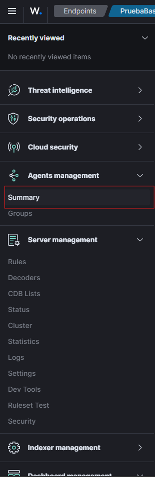
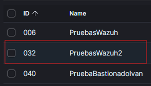
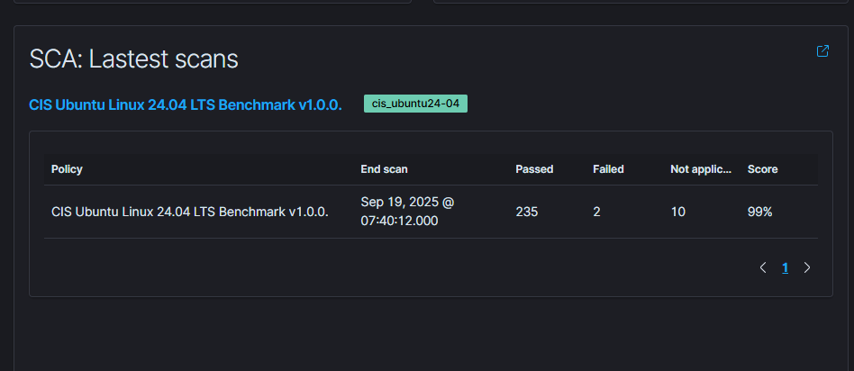
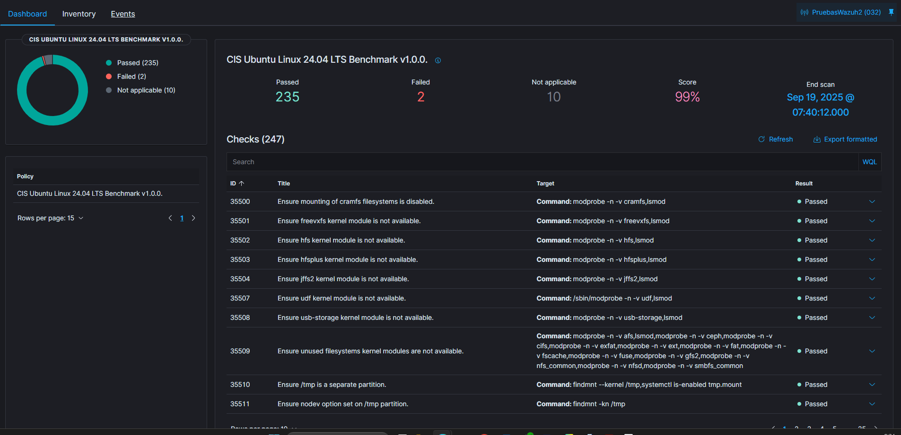

# HardenUbuntuServers
## Harden Ubuntu Linux servers to align with the CIS Benchmarks for Ubuntu.
## Starting up
```
git clone https://github.com/SysWithIvan/HardenUbuntuServers.git
cd HardenUbuntuServers 
```
At the top of ```harden.sh``` you’ll find environment variables you must adapt to your environment (banners, allowed networks, mail, and Postfix settings).

```
vi harden.sh

# Edit with correct data
AUTHORIZED_TEXT="

Put something useful to warn about the consequences of a bad use of the systems

"
HOSTS_ALLOW_TEXT="
sshd: --> put networks which from can access using ssh login 
slapd: --> put networks which from can validate across LDAP/Kerberos
"
SUPPORT_MAIL="
Put the mail which will receive the alerts, such as the space left on device alert.
"
POSTFIX_DOMAIN="
mydomain.net
"
POSTFIX_IP="
my_relay_ip
"
```
Save your changes and run:
```
sudo chmod +x harden.sh
sudo ./harden.sh
```
## Verifying the hardening
### WAZUH (recommended)
Wazuh is an open-source SIEM/XDR. Among other capabilities (vulnerability detection, malware detection, FIM…), it runs Security Configuration Assessment (SCA) policies mapped to CIS Benchmarks.

Here you can access to the [Wazuh installation guide](https://documentation.wazuh.com/current/installation-guide/index.html)

Instead of replacing the built-in policy, copy this repo’s SCA file to the wazuh SCA dir:
```
sudo mv /var/ossec/ruleset/sca/cis_ubuntu24-04.yml /var/ossec/ruleset/sca/cis_ubuntu24-04.yml.backup
sudo cp HardenUbuntuServers/cis_ubuntu24-04.yml /var/ossec/ruleset/sca/
sudo chown root:wazuh /var/ossec/ruleset/sca/cis_ubuntu24-04.yml
sudo chmod 660 /var/ossec/ruleset/sca/cis_ubuntu24-04.yml
```

To reevaluate the new rule file, restart the agent:
```
sudo systemctl restart wazuh-agent
```

#### Once you have reload the rules, you have to go to the Wazuh Manager URL and go inside Agents Management Summary:



#### Then, you choose your agent:



#### Go into CIS benchmark:


#### And finally you can see the scan report:



## Considerations
This project targets Ubuntu 24.04 and a specific environment. The provided SCA file intentionally differs from the official Wazuh policy. Some CIS controls (for example, partitioning requirements) are not implemented by the script and will appear as failed.

## Contact

If you want to help to improve this project, you have any doubt or suggestion, please contact with me:

Mail: ivantexenery@gmail.com
LinkedIn: [SysWithIvan](www.linkedin.com/in/iván-texenery-díaz-garcía-060621182)